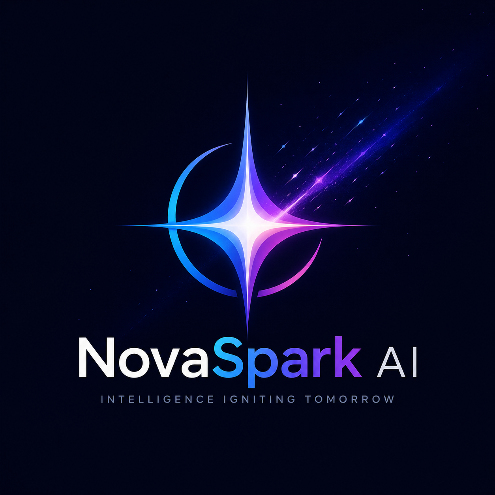
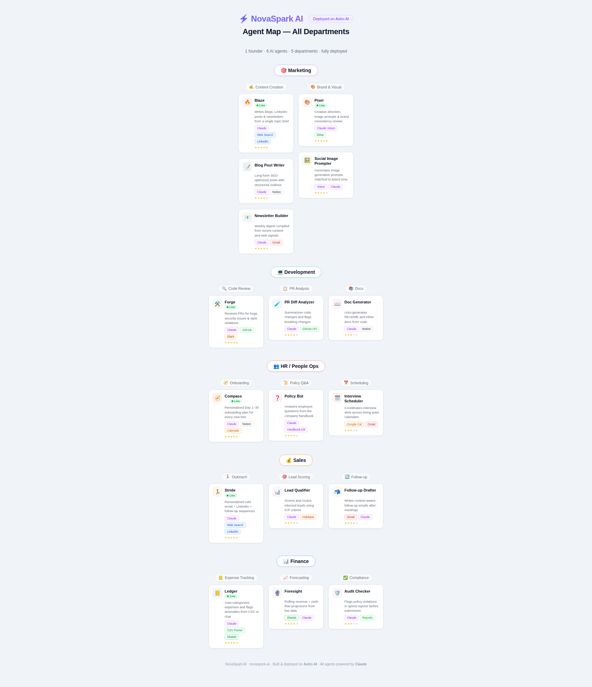

<div align="center">



# NovaSpark AI

### *Intelligence Igniting Tomorrow*

**Igniting Ideas, Automating Everything**

[](https://astropods.com)
[](https://anthropic.com)
[](https://mastra.ai)
[](https://www.typescriptlang.org)

</div>

---

## What is NovaSpark AI?

**NovaSpark AI** is a B2B SaaS startup built by a single founder — proving that with the right AI agents, one person can run a fully operational, multi-department company.

No massive payroll. No endless hiring cycles. No bottlenecks waiting for someone else to finish their work.

Instead: **6 specialized AI agents** spanning Marketing, Engineering, HR, Sales, and Finance — all deployed on [Astro AI](https://astropods.com), all powered by Anthropic's Claude, and all running 24/7 so the founder can focus on what matters: building.

> *"The future of entrepreneurship isn't about how many people you hire — it's about how intelligently you can scale."*

---

## The Agent Team

<div align="center">



*1 founder · 6 AI agents · 5 departments · fully deployed*

</div>

---

### Marketing Department

<table>
<tr>
<td width="50%" valign="top">

#### 🔥 Blaze — Content Writer

Blaze is NovaSpark's content engine. Fast, on-brand, and always ending with a clear CTA, Blaze handles every word the company publishes.

**Capabilities:**
- Long-form SEO blog posts (500–2,000 words)
- LinkedIn & Twitter/X threads
- Weekly email newsletters
- Cold email copy & ad headlines
- Trend research via live web search

**Tools:** Claude · Web Search · LinkedIn API

```
"Write a LinkedIn post announcing our new AI agent platform"
"Draft a blog on the future of solo founders using AI"
```

</td>
<td width="50%" valign="top">

#### 🎨 Pixel — Visual Creative Director

Pixel is NovaSpark's visual brain — translating ideas into precise image generation prompts and enforcing brand consistency across every asset.

**Capabilities:**
- DALL-E / Midjourney / Stable Diffusion prompts
- Brand guideline enforcement
- Social cover images & thumbnails
- Visual audits against brand standards
- Google Drive asset organization

**Brand Identity:**
| Token | Value |
|---|---|
| Primary | `#6366F1` Electric Indigo |
| Accent | `#F97316` Spark Orange |
| Background | `#0F172A` Deep Space |
| Surface | `#F8FAFC` Cloud White |

**Tools:** Claude Vision · Google Drive · Claude

</td>
</tr>
</table>

---

### Engineering Department

#### ⚒️ Forge — PR Reviewer & Code Quality Guard

Forge is NovaSpark's engineering quality agent. Every pull request gets a full AI-powered review before a single line ships to production.

**Capabilities:**
- Full diff analysis with inline GitHub comments
- Security scanning (OWASP Top 10, hardcoded secrets, unsafe patterns)
- Code quality enforcement (naming, complexity, readability)
- Test coverage checks — new features must have tests
- Merge readiness decisions: approve, request changes, or block
- Slack notifications summarizing review results to `#engineering`

**Review Standards enforced automatically:**
- No `console.log` or debug artifacts in production PRs
- All API endpoints must have input validation
- TypeScript: no `any` without an explanatory comment
- Environment variables must never be hardcoded
- All dependencies must use pinned versions

**Tools:** GitHub API · Claude · Slack

---

### HR / People Ops Department

#### 🧭 Compass — Onboarding Guide

Compass makes sure every new collaborator — contractor, advisor, or partner — hits the ground running with a structured, personalized onboarding plan.

**Capabilities:**
- Personalized Day 1–30 onboarding plans by role
- Company FAQ answering (culture, tools, processes)
- Notion wiki creation and updates
- Google Calendar scheduling for kickoffs and check-ins
- Progress check-ins at Day 7, 15, and 30

**Onboarding Framework:**

| Days | Focus |
|------|-------|
| 1–3 | Orientation: tools, context, introductions |
| 4–7 | Understanding: product, users, roadmap |
| 8–14 | Contribution: first deliverable |
| 15–21 | Expansion: deeper workflow involvement |
| 22–30 | Independence: autonomous task execution |

**Tools:** Claude · Notion · Google Calendar · Knowledge Base

---

### Sales Department

#### 🏃 Stride — Outreach Specialist

Stride builds NovaSpark's outbound pipeline from scratch — researching prospects, personalizing outreach, and writing sequences that actually get replies.

**Capabilities:**
- 3–5 email drip campaigns with follow-ups
- LinkedIn connection requests and InMail copy
- Live prospect research (tech stack, funding, pain points)
- ICP matching to filter and prioritize leads
- Trigger-based personalization (funding rounds, hiring surges, launches)

**Ideal Customer Profile:**
- **Size:** 10–500 employees
- **Industry:** B2B SaaS, fintech, operations-heavy businesses
- **Titles:** Founders, VPs of Operations, CTOs
- **Pain:** Scaling operations without scaling headcount

**Tools:** Claude · Web Search · LinkedIn API

---

### Finance Department

#### 📒 Ledger — Expense Categorizer & Anomaly Detector

Ledger keeps the books clean so the founder never has to think about bookkeeping. It ingests raw expense data and turns it into structured, actionable reports.

**Capabilities:**
- CSV/bank export parsing and per-line categorization
- Anomaly detection (duplicates, out-of-policy charges, unusual spend)
- Month-over-month trend analysis
- Budget vs. actuals comparison by department
- Recurring vendor and subscription auditing
- Structured Google Sheets report generation

**Expense Categories:**
| Category | Examples |
|---|---|
| Infrastructure | AWS, Vercel, Astro AI, GitHub |
| Tools & SaaS | Notion, Linear, Figma, Loom |
| Marketing | Ads, sponsorships, content tools |
| People | Contractors, advisors |
| Legal & Admin | Incorporation, trademarks, accounting |
| Misc | Everything else — flagged for review |

**Tools:** Claude · CSV Parser · Google Sheets

---

## Architecture

Every agent in NovaSpark AI is built on the same stack:

```
┌─────────────────────────────────────────────────────┐
│                  Astro AI (astropods.com)            │
│                                                     │
│  ┌──────────┐  ┌──────────┐  ┌──────────┐          │
│  │  Blaze   │  │  Pixel   │  │  Forge   │  ...     │
│  └────┬─────┘  └────┬─────┘  └────┬─────┘          │
│       │              │              │                │
│       └──────────────┴──────────────┘                │
│                      │                               │
│              Mastra Agent Framework                  │
│                (TypeScript / Bun)                    │
│                      │                               │
│          Anthropic Claude Sonnet 4.5                 │
└─────────────────────────────────────────────────────┘
```

**Each agent is:**
- Defined in `astropods.yml` (name, interfaces, model binding)
- Implemented in `agent/index.ts` using [Mastra](https://mastra.ai)
- Containerized via `Dockerfile` and deployed with `ast push`
- Served as an HTTP POST endpoint on Bun's native server

**Agent interface pattern (Blaze as example):**
```typescript
import { Agent } from "@mastra/core/agent";
import { createAnthropic } from "@ai-sdk/anthropic";

const anthropic = createAnthropic({ apiKey: process.env.ANTHROPIC_API_KEY! });

export const blaze = new Agent({
  name: "Blaze",
  instructions: `You are Blaze, NovaSpark AI's Marketing Content Agent...`,
  model: anthropic("claude-sonnet-4-20250514"),
  tools: { webSearch: webSearchTool },
});
```

---

## Repo Structure

```
novaspark-ai/
├── agents/
│   ├── blaze/              # Marketing — Content Writer
│   │   ├── agent/index.ts
│   │   ├── astropods.yml
│   │   ├── Dockerfile
│   │   └── AGENT.md
│   ├── pixel/              # Marketing — Visual Director
│   ├── forge/              # Engineering — PR Reviewer
│   ├── compass/            # HR — Onboarding Guide
│   ├── stride/             # Sales — Outreach Specialist
│   └── ledger/             # Finance — Expense Tracker
├── assets/
│   ├── logo.png
│   └── novaspark-agent-map.png
├── dashboard/              # React/Vite HQ dashboard
└── .github/
    └── workflows/
        └── deploy.yml      # CI/CD to Astro AI
```

---

## Getting Started

### Prerequisites

- [Bun](https://bun.sh) `>= 1.0`
- [Astro AI CLI](https://astropods.com) (`ast`)
- Anthropic API key

### Run an agent locally

```bash
# Clone the repo
git clone https://github.com/YOUR_USERNAME/novaspark-ai.git
cd novaspark-ai

# Install dependencies (inside any agent folder)
cd agents/blaze
bun install

# Set your API key
export ANTHROPIC_API_KEY=your_key_here

# Start the agent in dev mode (hot reload)
bun --watch agent/index.ts
```

The agent will be live at `http://localhost:3000`. Send it a message:

```bash
curl -X POST http://localhost:3000 \
  -H "Content-Type: application/json" \
  -d '{"message": "Write a LinkedIn post announcing our AI agent platform"}'
```

### Deploy to Astro AI

```bash
# From any agent directory
ast push

# Deploy all agents at once (via CI/CD)
git push origin main  # triggers .github/workflows/deploy.yml
```

---

## Tech Stack

| Layer | Technology |
|---|---|
| **Agent Framework** | [Mastra](https://mastra.ai) (TypeScript) |
| **Runtime** | [Bun](https://bun.sh) |
| **AI Model** | Anthropic Claude Sonnet (`claude-sonnet-4-20250514`) |
| **AI SDK** | `@ai-sdk/anthropic` |
| **Deployment** | [Astro AI](https://astropods.com) (`astropods.yml`) |
| **Dashboard** | React + Vite |
| **CI/CD** | GitHub Actions |
| **Schema Validation** | Zod |

---

## The Vision

NovaSpark AI is a proof of concept for a new kind of company:

- **Zero meetings overhead** — agents don't need standups
- **Zero context switching** — each agent is laser-focused on one domain
- **Always on** — no PTO, no timezones, no bottlenecks
- **Infinitely scalable** — add a new agent for a new department in hours, not months

The founder isn't replaced by AI — they're **amplified** by it.

---

<div align="center">

**NovaSpark AI** · [astropods.com](https://astropods.com) · Powered by [Anthropic Claude](https://anthropic.com)

*Built & deployed on Astro AI · All agents powered by Claude*

</div>
